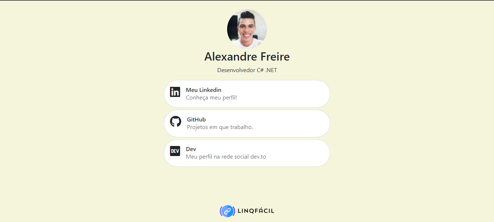

# LinqFácil
All links in One

* 1º:  fork this repository (don't change the name).
* 2º:  update de index.json from forked repository with your info and update on github.
* 3º:  after feels seconds your LinqFácil is already available on linqfacil.github.io/YOUR_GITHUB_USERNAME

## Example
My link is linqfacil.github.io/oalexandrefreire

### Coming soon
* Open the source code to community.
